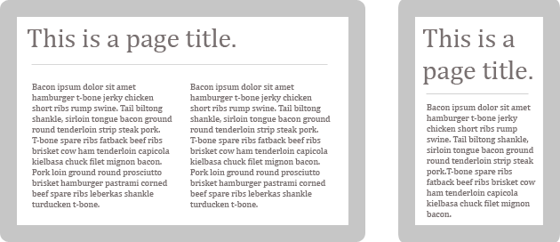

Voilà une croyance qui semble ancrée dure comme fer dans l’esprit de beaucoup de gens avec qui j’ai eu l’occasion de discuter récemment, que ce soit dans le cadre de mon travail ou autre : le scrolling, c’est le mal ! D’après ce que j’ai pu entendre, il faudrait donc éviter à tout prix les ascenseurs verticaux, ils compliquent la tâche du lecteur et risqueraient de le faire quitter votre site plus tôt qu’escompté. Je suis pour ma part assez farouchement opposé à cette vision…

C’est pourtant un argument qui revient régulièrement dans la construction de pages : "Ne pas faire de page trop haute, l’internaute ne scrollera pas". Tiens donc ? Il resterait bloqué en haut de sa page, à l’affût de l’info dont il a besoin, et faute de ne pouvoir la trouver, quitterait cette page sans autre forme de procès ? Voilà une vision qui me semble un peu désuette. Alors, oui, cela était effectivement vrai par le passé, lorsque nos souris n’étaient pas équipées de molettes. Il était alors plus compliqué de naviguer sur un site de manière verticale, car il fallait alors déplacer sa souris sur l’ascenseur pour se rendre à la partie de la page que l’on souhaitait atteindre. Mais les choses ont évolué : la très grande majorité des souris sont maintenant pourvues par défaut d’une molette; quant aux smartphones, un simple mouvement du doigt suffit pour scroller.

En fait, la véritable réponse à tout ça est un peu plus subtile : dans cet article sur les [mythes et légendes de l’ergonomie web](http://blog.academy-ecommerce.com/ergonomie-web-les-mythes-et-legendes-ont-la-vie-dure), l’idée soulevée et que l’internaute n’aura aucun souci à scroller, <strong>si il est conscient qu’il existe du contenu en dessous de la "ligne de flottaison"</strong>.

Grosso modo, il faut donc s’assurer que notre contenu s’écoule harmonieusement et suggère que tout ce qui n’est pas directement visible à l’écran reste tout de même accessible en scrollant.

Là où, en revanche, mon point de vue diffère de l’article ci-dessus, c’est sur cette fameuse "ligne de flottaison" dont on entend sans cesse parler : selon cette théorie, tous les éléments importants doivent être directement visibles par l’internaute. Je pense, comme beaucoup d’autres, que cette vision est-elle aussi en train de devenir peu à peu désuette, notamment en raison de la multiplication des supports (tablettes, smartphones, consoles…) et de l’avènement du responsive design. En fait, comme le résume parfaitement [Brad Fost](http://bradfrostweb.com/), _[there is no fold](http://www.thereisnopagefold.com/)_ (Il n’y a plus de ligne de flottaison). Ou, pour être exact, cette fameuse ligne changera d’un support à un autre. Finie, cette vision poussiéreuse d’un site ancré dans sa largeur de 960px, avec une résolution d’écran de 1280x720 :

> Bienvenue dans le World Wide Web, un médium interactif dans lequel les statistiques de résolution d’écran sont insignifiantes, les _viewports_ de nos navigateurs sont variables, et où le fait de scroller est devenu un standard.

Je n’aurais pas mieux dit :) Prenons un exemple concret, basé sur un template responsive.

Sur l’écran de gauche (ordinateur), la ligne de flottaison se situera en-dessous des deux premiers paragraphes. Sur l’écran de droite (tablette), elle se situera en-dessous du premier paragraphe. Alors attention : je ne dis surtout pas qu’il ne sert à rien de mettre les informations en haut de page, au contraire. Mais je pense que vouloir les faire apparaître au-dessus du *fold *a de moins en moins de sens aujourd’hui.

Pour résumer tout ça : en gros, non, le scrolling n’est pas un crime, au contraire… il est maintenant totalement rentré dans nos mœurs. Quant à la notion de ligne de flottaison, elle ne signifie plus grand chose aujourd’hui, ou du moins est-elle amenée à évoluer pour s’adapter à l’évolution de nos technos. Si vous pensez comme moi, n’hésitez surtout pas à diffuser la bonne parole ! :)

Mise à jour (08/02/2013) : pour plus de détails et d’études appuyant mes dires je vous invite à consulter cet article de <a href='http://uxmyths.com/post/654047943/myth-people-dont-scroll'>UXmyths.com</a>.
