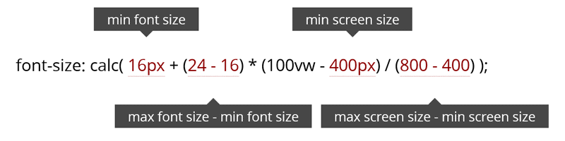

import ArticleOverflowContent from 'components/ArticleOverflowContent';
import FluidResizeMp4 from 'videos/fluid-resize.mp4';
import FluidResizeWebm from 'videos/fluid-resize.webm';
import FluidResizeNoBpMp4 from 'videos/fluid-resize-no-breakpoints.mp4';
import FluidResizeNoBpWebm from 'videos/fluid-resize-no-breakpoints.webm';
import ResponsiveResizeMp4 from 'videos/responsive-resize.mp4';
import ResponsiveResizeWebm from 'videos/responsive-resize.webm';

It’s been only a few days since I [last wrote](/articles/react-and-atomic-css/) about the power of Atomic / Utility-first CSS, but I feel like there is plenty left to say about that methodology and how it has become more and more popular over the last years. Frameworks based on it have been widly adopted: Tailwind has [22.2k](https://github.com/tailwindcss/tailwindcss) stars on GitHub, while Tachyons is close to [10k](https://github.com/tachyons-css/tachyons/) stars. New technologies have emerged: Atomic CSS-in-JS even seems to be a thing now with libraries such as [Styletron](https://github.com/styletron/styletron), [cxs](https://github.com/cxs-css/cxs/) or [Fela](https://github.com/robinweser/fela).

However, despite the maturity of the concept, I feel like there are a few blank spaces left around it. One of them is what I call _fluid user inferfaces_.

## A word on fluid UIs

I first read about that idea a few years ago, in an article called [Responsive And Fluid Typography With vh And vw Units](https://www.smashingmagazine.com/2016/05/fluid-typography/), published in [Smashing Magazine](https://www.smashingmagazine.com/). As its title implies tough, it was only focused on typography. Here’s the gist of it:

> Unlike responsive typography, which changes only at set breakpoints, fluid typography resizes smoothly to match any device width. It is an intuitive option for a web in which we have a practically infinite number of screen sizes to support.

A fluid interface basically follows that exact same principle, but extends it to other CSS properties which values are most likely to change with screen size: `margin`, `padding`, `width`, `height` etc.

That kind of approach ensures that CSS values won’t “jump” when reaching a breakpoint, thus offering a better rendering on different viewports:

<ArticleOverflowContent className="d-grid sm:g-2">
  <div>
    <figure>
      <video className="d-block w-100p" controls muted>
        <source src={ResponsiveResizeWebm} type="video/webm" />
        <source src={ResponsiveResizeMp4} type="video/mp4" />
      </video>
      <figcaption>Responsive interface</figcaption>
    </figure>
  </div>
  <div>
    <figure>
      <video className="d-block w-100p" controls muted>
        <source src={FluidResizeWebm} type="video/webm" />
        <source src={FluidResizeMp4} type="video/mp4" />
      </video>
      <figcaption>Fluid interface</figcaption>
    </figure>
  </div>
</ArticleOverflowContent>

In the side-by-side comparison above, we clearly see the benefits of a fluid UI: font-sizes and spacings are dynamically adjusted, content won’t suddenly become bigger when reaching a new breakpoint.

## How does it work?

At its core, a fluid CSS property is based on a mathematic formula powered by the `calc()` CSS function and the `vw` unit:

<figure>
  
  <figcaption>Illustration &copy; Smashing Magazine</figcaption>
</figure>

Four values need to be defined in order to make it work: minimum/maximum CSS values, and minimum/maximum breakpoints. With that formula, we tell the browser that we want our text to have a 16 pixels `font-size` at `400px`, 24 pixels at `800px`, and that it needs to adjust fluidly in-between. Here, we are using `px` values, but the formula will work equally fine with other values, such as `em` or `rem`.

However, if we simply apply that formula without adding any breakpoint, we will face an issue. Our values will keep decreasing on smaller resolutions, and increasing on higher resolutions:

<ArticleOverflowContent>
  <figure>
    <video className="d-block w-100p" controls muted>
      <source src={FluidResizeNoBpWebm} type="video/webm" />
      <source src={FluidResizeNoBpMp4} type="video/mp4" />
    </video>
    <figcaption>Fluid interface with no breakpoints</figcaption>
  </figure>
</ArticleOverflowContent>

In order to avoid that, we will have to update our code to add fixed minimum and maximum values. Our CSS class will look like this:

```css
/* The font-size will stay at 16px under 400px */
.some-class {
  font-size: 16px;
}

/* The font-size will be fluid between 400 and 800px */
@media screen and (min-width: 400px) {
  .some-class {
    font-size: calc(16px + (24 - 16) * (100vw - 400px) / (800 - 400));
  }
}

/* The font-size will become fix again above 800px */
@media screen and (min-width: 800px) {
  .some-class {
    font-size: 24px;
  }
}
```

Writing each fluid CSS class by hand seems a bit cumbersome though, let’s see how we can use a sprinkle of JavaScript to automate the job for us.

## From CSS to JS

The easiest way to generate the CSS above is to use a JavaScript [template litteral](https://developer.mozilla.org/en-US/docs/Web/JavaScript/Reference/Template_literals). I have created a function called `fluidCSS`, which takes an object as parameter and spits out the result. Simple, yet enough for what we are looking to achieve.

```js
const fluidCSS = ({
  prefix = '',
  selector = '',
  properties = [],
  values = { min: 0, max: 0 },
  breakpoints = { min: 0, max: 0 },
}) => `${prefix}${selector} {
  ${properties.map(property => `${property}: ${values.min}px;`).join('')}
}
@media screen and (min-width: ${breakpoints.min}px) {
  ${prefix}${selector} {
    ${properties
      .map(
        property =>
          `${property}: calc(${values.min}px + (${values.max} - ${values.min}) * (100vw - ${breakpoints.min}px) / (${breakpoints.max} - ${breakpoints.min}));`
      )
      .join('')}
  }
}
@media screen and (min-width: ${breakpoints.max}px) {
  ${prefix}${selector} {
    ${properties.map(property => `${property}: ${values.max}px;`).join('')}
  }
}
`;
```

The function is then called like this (`prefix` is not needed here as it defaults to an empty string):

```js
fluidCSS({
  selector: '.some-class',
  properties: ['font-size'],
  values: {
    min: 16,
    max: 24,
  },
  breakpoints: {
    min: 400,
    max: 800,
  },
});
```

OK, we have a working helper! Let’s move to the next step…

## Building the framework

This website is powered by the same CSS framework as the one used on [www.algolia.com](https://www.algolia.com), but modifying it to generate fluid class names would have taken a while. I really wanted to stick to the [_Keep It Simple Stupid_ (KISS)](https://en.wikipedia.org/wiki/KISS_principle) principle and iterate quickly to have a working proof of concept.

If we want to easily create a small, standalone Utility-first framework, three things are needed:

- The `fluidCSS` helper function detailed above
- A configuration array holding all possible values
- A small Node script to write the actual CSS file

Now that I have detailed how `fluidCSS` works, it must be paired with the configuration array. Here is an excerpt of the one I created (full source [here](https://github.com/ronanlevesque/ronanlevesque/blob/master/fluid-css.config.js)):

```js
const selectors = [
  {
    className: 'fsz',
    properties: ['font-size'],
    minMax: [
      [12, 16],
      [14, 18],
      [18, 32],
    ],
  },
  {
    className: 'ml',
    properties: ['margin-left'],
    minMax: [[4, 12]],
  },
  {
    className: 'mt',
    properties: ['margin-top'],
    minMax: [
      [4, 8],
      [48, 96],
    ],
  },
  {
    className: 'mr',
    properties: ['margin-right'],
    minMax: [[8, 12]],
  },
  // etc.
];
```

I went with shortcut names for my classes here, but it’s really only a matter of personal preference. I also like to use the same prefix naming convention as Tailwind, like so: `.prefix:color-red`. The class name should look like this:

```HTML
<div class="fluid:classname-min-max"></div>
```

To achieve that result, we need to map over our `selectors` array and return one big string using the `join()` method:

```js
const styles = selectors
  .map(selector =>
    selector.minMax
      .map(value =>
        fluidCSS({
          prefix: '.fluid\\:',
          selector: `${selector.className}-${value[0]}-${value[1]}`,
          properties: selector.properties,
          values: {
            min: value[0],
            max: value[1],
          },
          breakpoints: {
            min: 500,
            max: 1200,
          },
        })
      )
      .join('')
  )
  .join('');
```

The next step is to write that content into a new CSS file using the `fs` Node module.

```js
fs.writeFile('src/css/fluid.css', styles, err =>
  err
    ? console.log(err)
    : console.log('✅ Fluid CSS classes successfully generated.')
);
```

And that’s it, we now have a fully-working Utility-first fluid framework under the shape of a simple `.css` [file](https://github.com/ronanlevesque/ronanlevesque/blob/master/src/css/fluid.css). We can simply import it where we want, as we would with any other CSS file.

## What about CSS-in-JS?

While our solution should cover most situations, how would one implement fluid CSS within tools such as [Emotion](https://emotion.sh/docs/introduction)? Well, quite easily actually! Instead of relying on a CSS file, we can implement the idea directly at the component level thanks to the `fluidCSS` function and the `&` alias:

```jsx
// Using Emotion with `css`
render(
  <div
    className={css`
      ${fluidCSS({
        selector: '&',
        properties: ['font-size'],
        values: {
          min: 16,
          max: 24,
        },
        breakpoints: {
          min: 400,
          max: 800,
        },
      })}
      padding: 32px;
      border: 1px solid red;
    `}
  >
    Some content
  </div>
);

// Using Emotion with `styled`
const Component = styled.div`
  ${fluidCSS({
    selector: '&',
    properties: ['font-size'],
    values: {
      min: 16,
      max: 24,
    },
    breakpoints: {
      min: 400,
      max: 800,
    },
  })}
  padding: 32px;
  border: 1px solid red;
`;

render(<Component>Some content</Component>);
```

Of course, doing that for every property seems a bit cumbersome: it will be easier to create a new function based on `fluidCSS`, with some properties already pre-filled.

## The future of fluid CSS

During my research to write this blog post, I stumbled upon an interesting article from [CSS Tricks](https://css-tricks.com/), called [Simplified Fluid Typography](https://css-tricks.com/simplified-fluid-typography/). In it, Chris explains how the new `min()` and `max()` functions could be used to simplify the code that creates our fluid values, like this:

```css
html {
  font-size: min(max(16px, 4vw), 24px);
}
```

He goes even further with the `clamp()` function, which has the same effect with less code!

```css
html {
  font-size: clamp(16px, 4vw, 24px);
}
```

Nifty, right? Well, not so fast… For now, the browser support for those functions is [pretty low](https://caniuse.com/#feat=css-math-functions), but it’s an interesting idea to keep in mind for when they are more widely supported.
